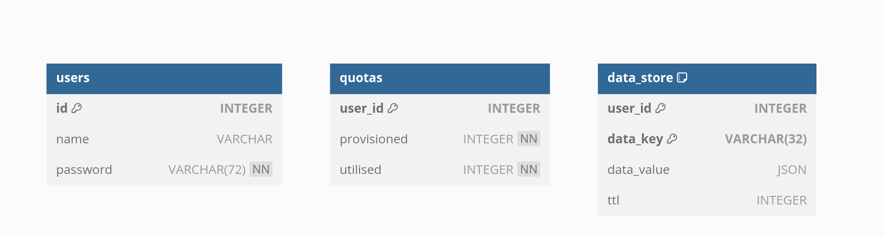

# key_value_datastore

## Overview

This project implements both single object and batch operations while enforcing storage quotas, key/value size limits, and TTL (time-to-live) expirations. Security and multi-tenancy are core aspects of the design, ensuring that each tenant's data is isolated and managed according to their configured usage.

## Setup

**Docker Setup(Recommended):**

***Prerequisites:***
- Docker

***Steps:***
Note: Use the exact docker commands with the containers and names to avoid any possible credentials mismatch.

1. Create a docker network for the services to communicate with each other.
```
docker network create kv-network
```
2. Start the MySQL container.
```
docker run --name mysql --network kv-network -e MYSQL_ROOT_PASSWORD=<password> -d mysql:8
```
3. Create the database in the container.
```
docker exec -it mysql mysql -uroot -p -e "CREATE DATABASE key_value_store;"
```
  Once this command is executed the CLI will prompt for the password. Enter the password provided in step 2 and press enter.

4. Start the Datastore application container.
```
docker run --name kv-store --network kv-network -p 8080:8080 -d santhosh2504/kv-store
```
5. Run the database migrations to create the tables.
```
docker exec -it kv-store bash -c "cd  ./migrations && flyway migrate"
```
The setup is complete and the application is ready to use. Try by making request to `localhost:8080`

***Note:*** To run the tests, run `make test` from the root directory after finishing the setup(can be anything docker setup or local setup). This step has to be followed by cloning the repository and running the `make test` command from the root directory. 


**Local Setup:**
***Prerequisites:***
- Go
- MySQL
- Flyway

***Steps:***
1. Clone the repository.
2. Start the MySQL server and create a database named `key_value_store`.
3. Update the database credentials in the [.env.template](./.env.template) file and in the [flyway.conf](./internal/db/schema/flyway.conf) file.
4. Run `make migrate` to setup the database.
5. Run `make run` to start the server.
6. Run `make test` to run the tests.

## Design Choices

- **Go Language:**  
  The project is fully implemented in Go. Its native support for concurrency, and performance characteristics make it an ideal choice for this project.

- **Security & Access Control:**  
  User authentication is enforced via JWT tokens. API handlers extract a tenant's unique identifier from the token to ensure that each user can only access their own data. This enforces secure multi-tenancy.

- **Database schema design:**  
    

    - **Transactions:**  
        All write operations (create, batch create, delete) are wrapped in transactions. This guarantees atomicity — either all changes succeed or none are applied.

    - **Schema Migrations:**  
        The project uses a `flyway` migration tool to manage database schema changes. The migration files are stored in the [schema](./internal/db/schema) directory.

    - **Quota Checks:**  
        Each user (tenant) is assigned a provisioned storage capacity. A separate quotas table tracks both the provisioned limit and the storage currently utilized. All object operations update the tenant's quota accordingly.

        During object creation (both single and batch):
        - The service computes the size of the JSON-serialized value.
        - It checks if adding the new object(s) would exceed the tenant's remaining quota.
        - For the batch API, the total combined size of all objects is calculated and validated against both the tenant's available capacity and an enforced limit (e.g., a combined 4MB limit).

    - **Individual Object Operations:**  
        - **Key Limit:** Keys are restricted to 32 characters.
        - **Value Limit:** Each JSON object is limited to   16KB.
        - **TTL Support:** Each object may have an associated TTL. Objects become unavailable once their TTL expires.

    - **Batch Operations:**  
        Batch creation aggregates multiple objects to allow efficient uploads. The design includes:
        - **Combined Size Limit:** The total combined size of the JSON-encoded values is capped (e.g., 4MB). This guard is critical for ensuring that batch requests do not overwhelm the system.
        - **Single Transaction:** Batch operations are executed within a single DB transaction to maintain atomicity and consistency.
        - **SQL Placeholders:** The implementation builds a single SQL query with multiple placeholders to update/inject the data store efficiently. 
   
    - **TTL Expiry Handling:**  
        Uses SQL Event Schedulerto handle TTL expiry. It is scheduled to run every day to cleanup the expired data from the data store. 
        
        Can be improved to handle TTL expiry in real-time like every 10 minutes but have to consider the trade-off between the cleanup frequency and the cost impact.

        ```
        CREATE EVENT clean_expired_data
        ON SCHEDULE EVERY 1 DAY
        DO
          DELETE FROM data_store
          WHERE ttl != 0 AND ttl < UNIX_TIMESTAMP(NOW());
        ```

- **Logging:**  
   Uses structured logging (e.g., via `slog`) that records key events and error details. This enhances troubleshooting and monitoring when coupled with a monitoring tool.

- **Integration Tests:**  
  Integration tests are written using Ginkgo and Gomega. They cover:
  - Basic CRD operations.
  - Boundary conditions (e.g., key length, value size).
  - Batch operations with combined value size tests – verifying scenarios where the total size is just below or above the 4MB limit.
  - Quota enforcement to ensure tenant-level constraints are honored.

- **Documentation**
  All the API behaviours are captured and documented in an API specification documents following the OpenAPI conventions. The spec file is attached in the [swagger.yaml](./swagger.yaml) file.

### Future Enhancements
  
- **Rate Limiting:**  
  Implement rate limiting to prevent security attacks, abuse from a single tenant.

- **Caching:**  
  Implement caching to improve performance for handling quota checks.
  
- **Enhanced Monitoring:**  
  Integrate with monitoring tools (e.g., Prometheus, Cloudwatch) to collect metrics on request rates, error rates, and system performance.

### Compatability
With the docker setup, the application should be up and running in all the operating systems that supports docker.

In scenario of cloning and running the application locally, it is tested with linux, so it should work with any linux based system, and mac os, but not sure about windows.

### Time spent
It took me around ~12 hours to complete the project. And an additional 1 hours for the documentation and containerizing the application.